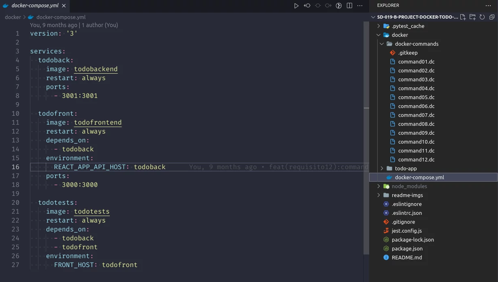
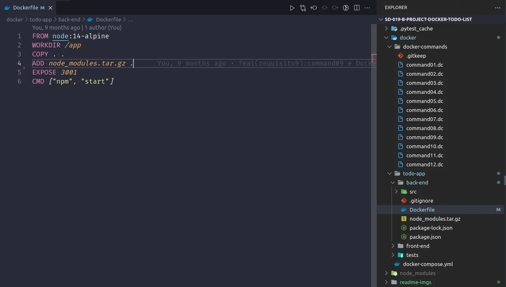
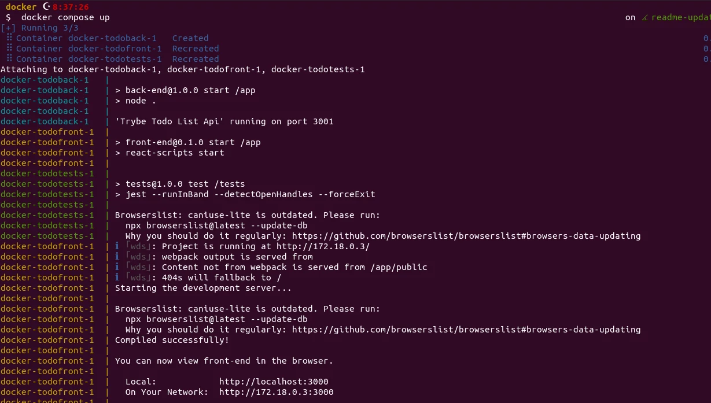

# Sobre

## Seção: `Containers - Docker`

- Feita introdução há importancia e funcionamento do Docker, foi apresentado conceito de empacotamento de aplicações, imagens, containers, camadas, instalação e CLI.
- Resolvendo problemas de complexidade e de compatibilidade nas aplicações, evitando o problema de funcionar em um local e outro não, criando um ambiente virtual, onde a aplicação é iniciada de forma mais leve e barata comparada a criação de uma máquina virtual, por meio da conteinerização.
#

  

>*Conteúdo sobre comandos usados para o funcionamento do docker*
#
## Projeto: `Docker Todo List`

- Projeto consiste em "levantar" um docker para o funcionamento de uma aplicação ja desenvolvida pela trybe, um frontend com backend de uma aplicação "todo list", a ideia foi de aplicar os comandos do docker e botar em prática o uso do docker apresentada na seção. Olhando a pasta [docker-commands](https://github.com/davidrogger/trybe-project-docker-todo-list/tree/readme-update/docker/docker-commands) foi analisando por um testes automatizados da trybe, os comandos corretos para funcionamento do docker e aplicações.

# Tecnologias e ferramentas usadas 🛠

# Desafios

- Esse projeto para praticar o uso do docker, foi bem simples, seguindo apenas o material apresentado pela trybe e pela documentação do docker.

# Conclusão

- A ideia do Docker com containers facilita muito a vida evitando vários processos de instalação, apenas instalando o docker, e coletando as imagens necessários no hub de imagens do docker, porém existe um consumo alto ainda na parte de espaço em disco, caso você tenha pouco espaço.

  

    <strong>
      :newspaper_roll: Requisitos solicitados durante o desenvolvimento do projeto
    </strong>
  

 
### Requisitos
*Nome* | *Avaliação*
--- | :---:
1 - Crie um container em modo interativo, sem rodá-lo, nomeando-o como `01container` e utilizando a imagem `alpine` na versão `3.12` | :heavy_check_mark:
2 - Inicie o container `01container` | :heavy_check_mark:
3 - Liste os containers filtrando pelo nome `01container` | :heavy_check_mark:
4 - Execute o comando `cat /etc/os-release` no container `01container` sem se acoplar a ele | :heavy_check_mark:
5 - Remova o container `01container` | :heavy_check_mark:
6 - Faça o download da imagem `nginx` com a versão `1.21.3-alpine` sem criar ou rodar um container | :heavy_check_mark:
7 - Rode um novo container com a imagem  `nginx` com a versão `1.21.3-alpine` em segundo plano nomeando-o como `02images` e mapeando sua porta padrão de acesso para porta `3000` do sistema hospedeiro | :heavy_check_mark:
8 - Pare o container `02images` que está em andamento | :heavy_check_mark:
9 - Gere uma build a partir do Dockerfile do `back-end` do `todo-app` nomeando a imagem para `todobackend` | :heavy_check_mark:
10 - Gere uma build a partir do Dockerfile do `front-end` do `todo-app` nomeando a imagem para `todofrontend` | :heavy_check_mark:
11 - Gere uma build a partir do Dockerfile dos `testes` do `todo-app` nomeando a imagem para `todotests` | :heavy_check_mark:
12 - Suba uma orquestração em segundo plano com o docker-compose de forma que `backend`, `frontend` e `tests` consigam se comunicar | :heavy_check_mark:

  

    <strong>
      :memo: Todo list
    </strong>
  

  - [x] - ~~Criar aplicação com base nos requisitos da trybe.~~ 

#

  

